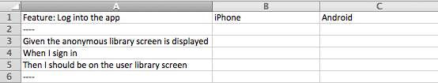
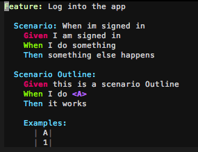

gherkin_csv
==========


Converts a feature file into a csv e.g. demo.feature => demo.csv

 



##usage

```
$>gherkin_csv --feature demo.feature
```

##Installation
```
cmake
make 
sudo make install
```

###Deps

```
cmake
jnxlibc (https://github.com/AlexsJones/jnxlibc)
```
